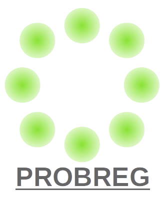
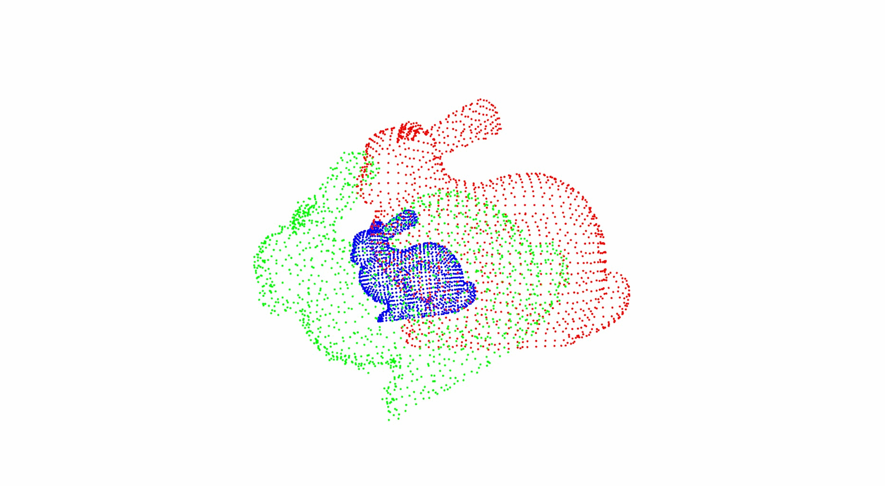
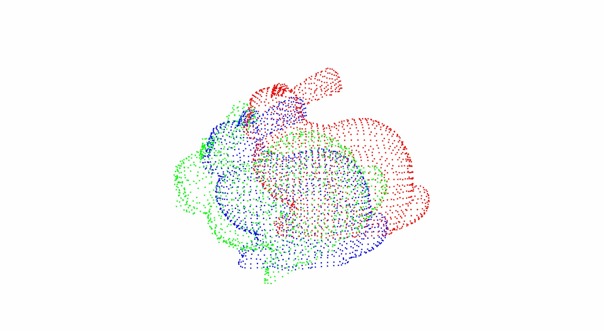
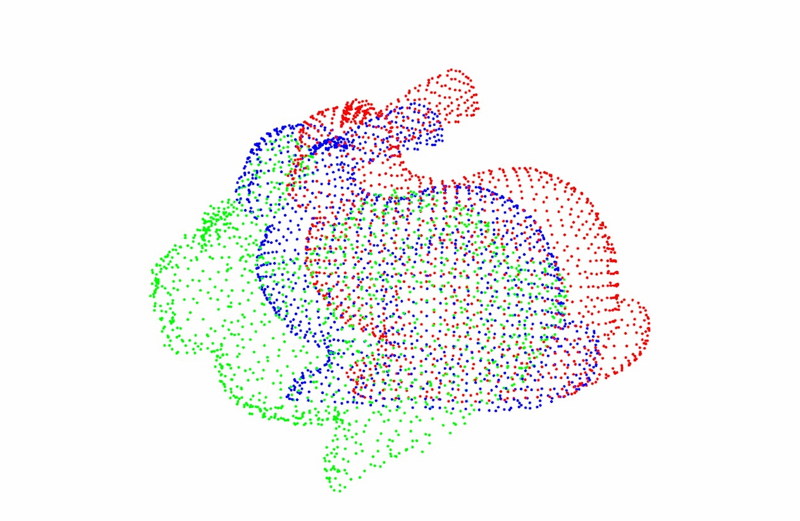
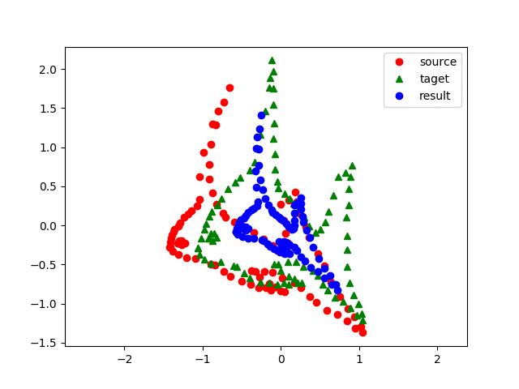
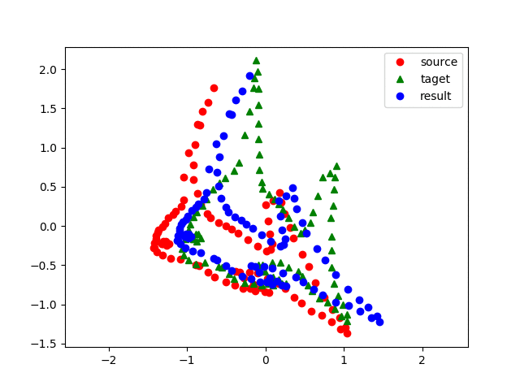

# 

Implementation of point cloud **reg**istration algorithms with **prob**ablistic model.

## Algorithms

* [Coherent Point Drift](https://arxiv.org/pdf/0905.2635.pdf)
* [GMMReg](https://ieeexplore.ieee.org/document/5674050)
* [Support Vector Registration](https://arxiv.org/pdf/1511.04240.pdf)
* [GMMTree](https://arxiv.org/pdf/1807.02587.pdf)
* [FilterReg](https://arxiv.org/pdf/1811.10136.pdf)

## Install

Install from source.

```
git clone https://github.com/neka-nat/probreg.git --recursive
cd probreg
pip install -e .
```

## Quick start

This is a sample code that reads a PCD file and calls CPD registration.
You can easily execute registrations using [Open3D](http://www.open3d.org/) and draw the results.

```py
import copy
import numpy as np
import open3d as o3
from probreg import cpd

# load source and target point cloud
source = o3.read_point_cloud('bunny.pcd')
target = o3.read_point_cloud('bunny.pcd')
# transform target point cloud
th = np.deg2rad(30.0)
target.transform(np.array([[np.cos(th), -np.sin(th), 0.0, 0.0],
                           [np.sin(th), np.cos(th), 0.0, 0.0],
                           [0.0, 0.0, 1.0, 0.0],
                           [0.0, 0.0, 0.0, 1.0]]))
# compute cpd registration
tf_param, _, _ = cpd.registration_cpd(source, target)
result = copy.deepcopy(source)
result.points = tf_param.transform(result.points)

# draw result
source.paint_uniform_color([1, 0, 0])
target.paint_uniform_color([0, 1, 0])
result.paint_uniform_color([0, 0, 1])
o3.draw_geometries([source, target, result])
```

## Results

### Regid registration

#### CPD


#### SVR


#### GMMTree


#### FilterReg


### Non rigid registration

#### CPD


#### SVR
